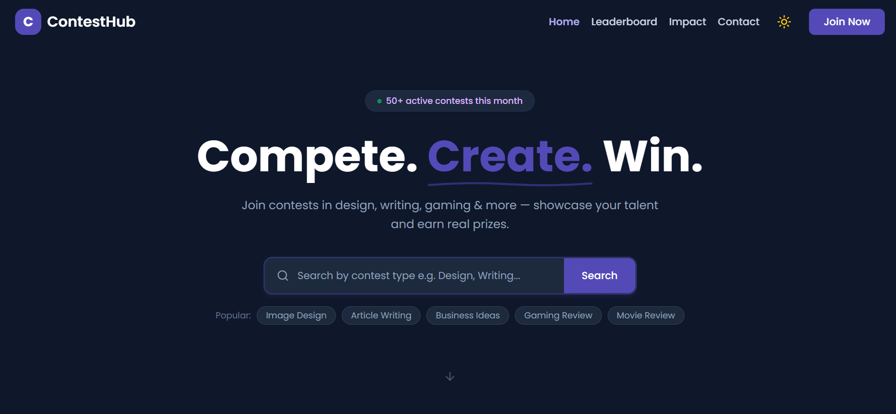

# ContestHub 🏆

A full-stack contest management platform where users can discover, participate in, and manage creative contests. Built with role-based access for admins, contest creators, and participants.

🌐 **Live Site:** [https://contesthub-zarin.netlify.app](https://contesthub-zarin.netlify.app)

---

## Screenshot



---

## Tech Stack


---

## Test Credentials

**Admin:**
- Email: admin01@contesthub.com
- Password: admin05_ContestHub

**Creator:**
- Email: creator01@contesthub.com
- Password: creator07_ContestHub

---

## Key Features

- **Three Role System** — Separate dashboards for Normal Users, Contest Creators, and Admins
- **Stripe Payment Integration** — Entry fee payment via Stripe; participant count updates on success
- **JWT Authentication** — Firebase Auth for login + JWT tokens securing private API routes
- **Live Countdown Timer** — Real-time countdown per contest; closes registration after deadline
- **Winner Declaration** — Creators view all submissions and declare a winner after the deadline
- **Contest Search & Filter** — Search by name or filter by category with instant results
- **Leaderboard** — Ranks users by contest wins with a top-3 podium display
- **Dark / Light Theme** — Theme toggle with preference saved in localStorage
- **Pagination** — Admin manage contests table paginated with 10 items per page
- **Fully Responsive** — Works across mobile, tablet, and desktop

---

## Dependencies

```json
"@tanstack/react-query"
"axios"
"firebase"
"framer-motion"
"react-hook-form"
"react-datepicker"
"react-hot-toast"
"recharts"
"lucide-react"
"stripe"
"jsonwebtoken"
"mongoose"
"cors"
"dotenv"
```

---

## Run Locally

### 1. Clone the repositories

```bash
git clone https://github.com/zarin-anjum/assignment-11-client
git clone https://github.com/zarin-anjum/assignment-11-server  
```

### 2. Set up the client

```bash
cd assignment-11-client
npm install
```

Create a `.env` file in the client root:

```env
VITE_apiKey=your_firebase_api_key
VITE_authDomain=your_firebase_auth_domain
VITE_projectId=your_firebase_project_id
VITE_storageBucket=your_firebase_storage_bucket
VITE_messagingSenderId=your_firebase_messaging_sender_id
VITE_appId=your_firebase_app_id
VITE_STRIPE_PUBLIC_KEY=your_stripe_public_key
VITE_SERVER_URL=http://localhost:5000
```

```bash
npm run dev
```

### 3. Set up the server

```bash
cd assignment-11-server
npm install
```

Create a `.env` file in the server root:

```env
DB_USER=your_mongodb_user
DB_PASS=your_mongodb_password
ACCESS_TOKEN_SECRET=your_jwt_secret
STRIPE_SECRET_KEY=your_stripe_secret_key
```

```bash
node index.js
```
